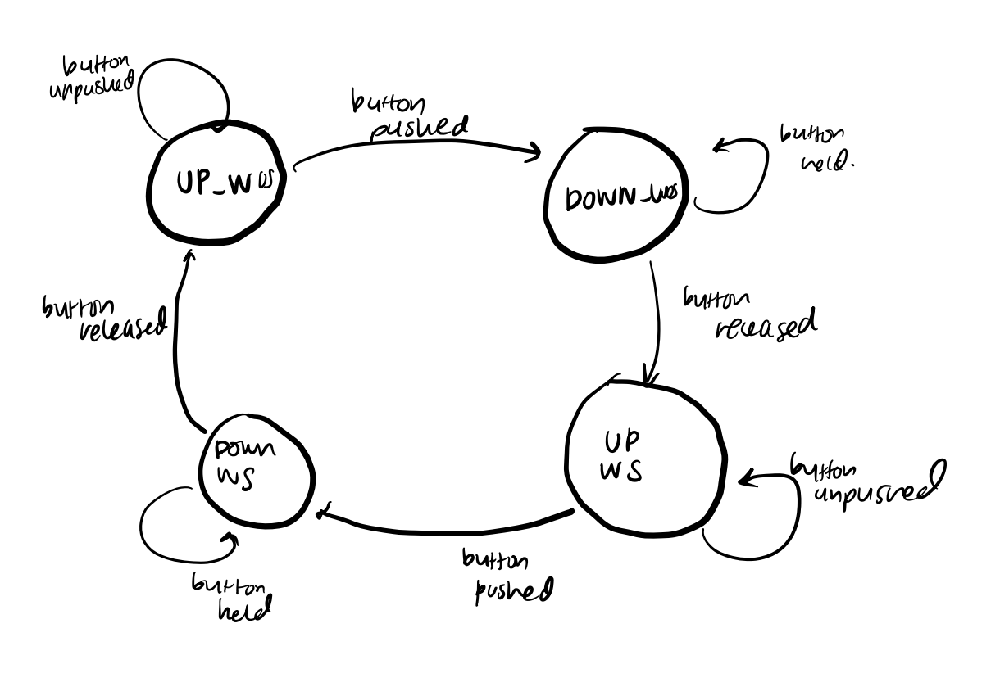
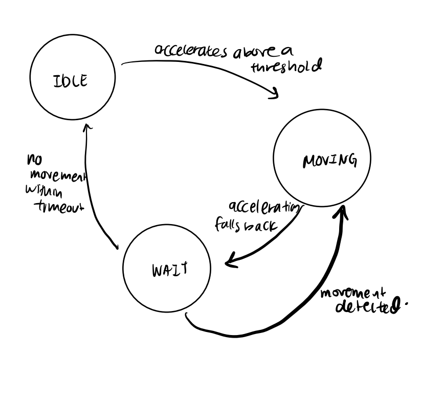

# Exercise 1: Smart Clock Write Up

[demonstration video](https://drive.google.com/file/d/1IHUcFbWmqL93KF1N1b3ebMKm4jEcyz6w/view?usp=sharing)

# Summary
In my Smart Clock, I have implimented all the components described in the project specifications which I broke down into a few categories based on functionality to incrementally impliment the project. The following categories where the ones I used and I go into more depth into each of them in the following sections:

1. Retrieval of Time
2. Parsing the Retrieved Time
3. Displaying Time information on LCD
4. Switching between modes of display
5. Motion Activation Mode & Always-ON

## Retrieval of Time 
This code consisted of using the do_http_GET() method which we have been using for the past few lessons. This do_http_GET() method sends a request in the form of a request buffer and retrieves current time information stored as a character array in the response buffer. This meets specification 5 of the assignment. The do_http_GET() method is called once at the start of the program in setup() and from within the loop(). When the do_http_GET() method is called, first a request buffer of the following form is created and passed in:

```cpp
sprintf(request_buffer,"GET http://iesc-s3.mit.edu/esp32test/currenttime HTTP/1.1\r\n");
strcat(request_buffer,"Host: iesc-s3.mit.edu\r\n"); //add more to the end
strcat(request_buffer,"\r\n"); //add blank line!
```

In addition, I only send out these requests every 1 minutes which I set as my GETTING_PERIOD and I accomplish this through an if statement which checks if the time since the previous pull from the server stored in variable pulled_time is more than the GETTING_PERIOD.

```cpp

if (millis() - pulled_time > GETTING_PERIOD) {
    //code to create buffer
    do_http_GET("iesc-s3.mit.edu", request_buffer, response_buffer, OUT_BUFFER_SIZE, RESPONSE_TIMEOUT, true);
}
```
## Parsing the Retrieve Time
When the time is retrieved from the server, it is in the form of a c-string and I need to parse it and store the time in the global hour, minutes, and second variables. To accomplish this, I use my parse_time method. The parse_time method makes use of the strtok() string splitter as well the atoi() method to convert form characters to integers. A snippet of code can be seen below:

```cpp
void parse_time() {
  Serial.println("Parsing Now");
  char delimiter = ' ';
  char* ptr = strtok(response_buffer, &delimiter);

  delimiter = ':';
  ptr = strtok(NULL, &delimiter);
  hours = atoi(ptr);//parse pointer
  if (hours > 12) {
    hours -= 12;
    is_am = false;
  }
  //etc...
}
```
First I used the space (' ') character as my delimeter to jump forward past the date information. Then I used the delimeter of (':') and grabbed hours. After convering with atoi to an integer, processing the hours required subtracting 12 in the case where the hours was greater than 12 because of the 24-hour time format the server uses. This also updates is_am, a boolen storing AM/PM information, to false. The same logic is then applied to the other minutes and seconds variables.

## Displaying Time information on LCD
So this method was called LCDdisplay() and it dealt with formatting all the output as well the logic for what type of output should be displayed. In the first section: 

```cpp
if (mvmtState == IDLE && motionState == 1) {
      tft.fillScreen(TFT_BLACK);
  } else {
      //more code
  }
```
An if/else statement determines whether or not the screen should be even dispalying any information. If there is no motion going on, hence mvmtState being equal to IDLE, and the motionState is set to 1, meaning the clock is in motion-activated mode, this means that only a blank screen is needed. Otherwise, what time to display is considered in the else statement.

In the next subsection of code inside of the else, 

```cpp
char output[100];
    if ((millis()-last_time)/1000 >= 1) {
      seconds += 1;
      last_time = millis();
    }
    if (seconds >= 60) {
      minutes += seconds/60;
      seconds %= 60;
      if (minutes >= 60) {
        hours += minutes/60;
        minutes %= 60;
        if (hours > 12) {
          is_am = !is_am;
          hours -= 12;
        }
      }    
    }
```
We increase the time locally, relying on the millis() method, because we are constrained on how many times we can can a "real-time" request from the server. The millis time difference is converted and added on to the seconds and the cascade of if statements accounts for rollovers in the seconds, minutes, and hours variables to ensure we are dispalying a proper time.

The next segment of code works with colon flashing as well as whether to dispaly HH:MM or HH:MM:SS mode. 

```cpp
if (displayState == 1) {
    //Display stuff in HH:MM (more details to come)
} else {
    //Display hours, minutes, and seconds
    sprintf(output, "%d:%02d:%02d", hours, minutes, seconds); 
    tft.setCursor(0, 0, 1);
    tft.println(output);
}
```
First, the outer if statemnt whether displayState is 1 which means using HH:MM mode, or if the display state is 2, meaning we are using HH:MM:SS mode. The displayState of 2 is pretty simple and is constructed just by printing out a string consisting of the global variables. The formatted print allows us to pad only the minutes and seconds with a 0 in front if need to ensure they take up two spaces.

Next, we look into the code within displayState 1 that allows for us to have flashing.
```cpp
if (millis() - colon_time <= COLON_PERIOD/2) {
    sprintf(output, "%d%s%02d   ", hours, ":", minutes); 
} else {
    sprintf(output, "%d%s%02d   ", hours, " ", minutes);
    if (millis() - colon_time > COLON_PERIOD) {
        colon_time = millis();
    }
}
    tft.setCursor(0, 0, 1);
    tft.println(output);
} else {
    sprintf(output, "%d:%02d:%02d", hours, minutes, seconds); 
    tft.setCursor(0, 0, 1);
    tft.println(output);
}
```
To determine whether the colon should be on or off, we use the elapsed time since the colon_time, a variable storing the last time a colon was displayed. If this value is less than 50% of the COLON_PERIOD which is set at 2 seconds, the colon will be displayed. This behavior allows the colon to be displayed for one second and then not for the next.

The final small segment of code is as follows:
```cpp
if (is_am) {
    tft.setCursor(0, 30, 1);
    tft.println("PM");
} else {
    tft.setCursor(0, 30, 1);
    tft.println("PM");
}
```
It allows us to display whether the clock is in AM or PM mode through checking the simple boolean variable. Set cursor is moved so that it lies on the next line.

## Switching between modes of display
To switch between modes of time dispaly, either HH:MM or HH:MM:SS, we have to use the button connected to PIN 45. These two modes are indicated by displayState which is 1 for HH:MM and 2 for HH:MM:SS. The buttom information is read in to the bvalue integer. Then we use the global state variable to progress our state machine which describes our button's state. Essentially we cycle between 4 values of STATE defined globally as follows:

```cpp
const uint8_t UP_WOS = 0; 
const uint8_t DOWN_WOS = 1; 
const uint8_t UP_WS = 2; 
const uint8_t DOWN_WS = 3;
```

The 4 values indicated with the button is the UP state and the display is without seconds, the button is in the DOWN state and the display is still without seconds, the button is in the UP state and is displaying seconds new, and finally the button is in the DOWN state and is displaying seconds. By using a switch statement with these 4 cases, we are then able to progress through the state machines based off of the readings from the button. In addition, the following lines of code were added to adjust for button bouncing effects, by setting a minimum amount of time (PUSH_PERIOD is set to 1000/5 msec) since the last action to change states:

```cpp
if ((millis()-push_time > PUSH_PERIOD) && bvalue == 1) {
}
```

The following state diagram shows how this works:


## Motion Activation Mode & Always-ON
These modes are described by the state variable motionState which is set to 1 for motion activated and 2 for always on. Just as in the previous section, the 2nd button also has it's own state variable named state2 which switches between 4 states and is regulated by it's own pushed_time2 variable. In addition, when the state of the system is in motionState = 1 or the motion-activated mode, the code then checks for the mvmtState of the variable, which tells us whether the item is in IDLE, MOVING, or WAIT. The average acceleration values, a 3-point moving average of the total acceleartion, determines whether the clock has started and stopped moving based on whether the acceleration has exceeded specified thresholds. The following state diagram explains this logic. 



The WAIT state is defined for the period of time when time is displayed on the screen but the screen will turn off is nothing happens within the given time period. 


